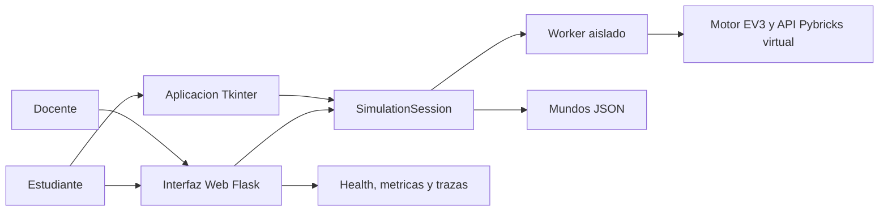
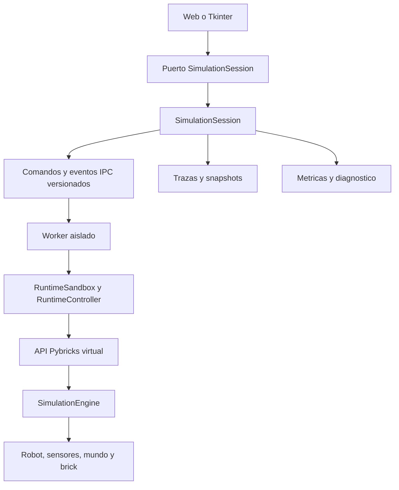

# Arquitectura C4

> Estado: revisado al 2026-08-05. Versión aplicable: `1.5.0`. Fuentes:
> `openspec/project.md`, `openspec/specs/` y código productivo.

## Contexto

El sistema es un simulador educativo local. No reemplaza la comprobacion final
en hardware EV3 ni debe exponerse publicamente sin una configuracion de
produccion, HTTPS y autenticacion apropiada para el contexto.

## Contenedores

| Contenedor | Responsabilidad | Interfaces principales |
|---|---|---|
| Web Flask | UI, API HTTP, sesiones, SSE/polling y metricas | `/`, `/worlds`, `/help`, `/healthz`, `/metrics` |
| Tkinter | Cliente de escritorio local, editor, canvas y telemetria | `DesktopSessionAdapter` |
| `SimulationSession` | Contrato versionado de comandos, estados, snapshots, errores, depuracion y trazas | `SimulationSessionPort` |
| Worker aislado | Ejecuta scripts Pybricks con IPC, limites y recuperacion | `runtime/isolated_worker.py` |
| Motor y dominio | Robot, mundo, sensores, brick, fisica y perfiles | `core/`, `domain/`, `pybricks_api/` |
| Almacenamiento | Mundos JSON, ejemplos y metadatos de sesion configurables | `worlds/`, `examples/`, backend de sesion |

La Web divide su frontend por responsabilidades de API, sesión, renderizado,
telemetría, mundo, diálogos, ayuda y depuración. Tkinter usa presentadores y
adaptadores de sesión; las diferencias visuales admitidas se limitan a controles
nativos, no a casos de uso.

## Componentes y limites

- Las UI no acceden a atributos privados del motor ni del runtime.
- Todo comando de sesion se correlaciona con `session_id` y `command_id`.
- Los snapshots, errores y eventos IPC son serializables y versionados.
- El editor de mundos prepara y valida mundos; no ejecuta scripts.

## Flujo de ejecucion y recuperacion

1. La UI crea o recupera una sesion y envia un comando correlacionado.
2. `SimulationSession` valida la transicion, conserva estado de depuracion y
   reenvia el comando al worker asignado.
3. El worker ejecuta el script en el sandbox, publica eventos y snapshots.
4. La sesion descarta eventos obsoletos, actualiza trazas y comunica el estado
   a Web/Tkinter sin exponer internals de dominio.
5. Ante una caida recuperable del worker, la sesion recrea el proceso y restaura
   script, configuracion y depuracion documentados. El resultado se informa a la UI.

El modo local solo es compatibilidad explicita de desarrollo/pruebas mediante
`EV3_LOCAL_RUNTIME_ENABLED=true`; la ruta predeterminada usa worker aislado.

## Estados y consistencia terminal

`created`, `ready`, `running`, `paused`, `finished`, `error`, `timed_out` y
`stopped` forman el ciclo observable de sesión. Los eventos incluyen generación
y correlación para descartar respuestas tardías. Una finalización actualiza
primero el snapshot coherente de robot, canvas, motores, sensores, LCD y
telemetría; después emite la notificación. Reiniciar cancela la generación,
limpia traza/artefactos y restaura la pose inicial del mundo activo.

## Operacion y observabilidad

- `/healthz` devuelve version, diagnostico de sesiones, worker y backend.
- `/metrics` devuelve JSON o formato Prometheus si se solicita `format=prometheus`
  o `Accept: text/plain`.
- Las metricas incluyen solicitudes, errores 5xx, sesiones, workers, memoria,
  CPU, cola de eventos y tick mas reciente.
- Las trazas correlacionan ejecuciones por sesion, comando y worker cuando la
  instrumentacion OpenTelemetry esta configurada.

## Verificacion relacionada

- Contrato y worker: `tests/application/test_session_contract.py` y
  `tests/runtime/test_isolated_worker.py`.
- Paridad de interfaces: `tests/shared/test_interface_execution_parity.py`.
- Web y observabilidad: `tests/web/` y `tests/e2e/test_web_playwright.py`.
- Riesgos y diferencias de hardware: `Documentos/DIFERENCIAS_SIMULADOR_ROBOT.md`.
- Estado de liberación: `Documentos/ESTADO_ACTUAL_PROYECTO.md`.
